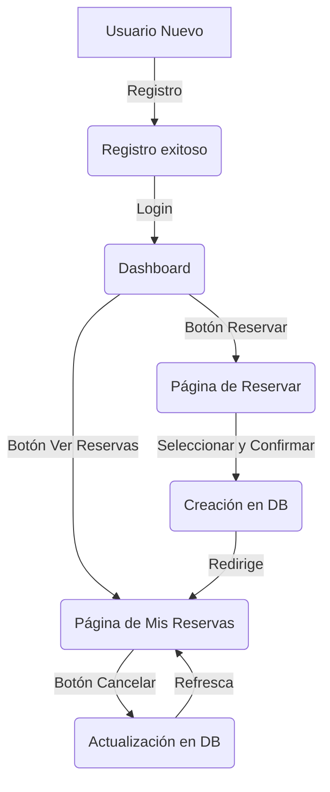

# Flujos Completos de la Aplicación

Este documento detalla sistemáticamente el recorrido técnico (archivos, funciones y lógica) de cada funcionalidad del sistema.

---

## 1. Gestión de Usuarios y Autenticación

### A. Registro de Usuario (Creación de Cuenta)
Este proceso permite a nuevos usuarios darse de alta en el sistema con permisos básicos.
- **Frontend**: `app/templates/register.html`.
    - **Acción**: El usuario rellena Nombre, Apellido, Email y Contraseña.
    - **Lógica JS**: El evento `submit` del formulario captura los datos y los envía como un objeto JSON mediante `POST` a `/auth/register`.
- **Backend**: `app/routers/auth.py` -> función `register()`.
    1.  **Validación**: Llama a `crud.get_user_by_email()` para asegurar que el correo no esté en uso.
    2.  **Creación**: Llama a `crud.create_user()`.
    3.  **Lógica CRUD** (`app/crud.py`):
        - Hashea la contraseña usando `pwd_context`.
        - Crea el registro en `models.User`.
        - Crea automáticamente los permisos por defecto en `models.Permission` (can_rent=True).
    4.  **Logs**: El router registra: `Nuevo usuario registrado: email@example.com`.
- **Resultado**: Muestra un aviso de éxito y redirige a la página de login (`/`).

### B. Inicio de Sesión (Login)
- **Frontend**: `app/templates/login.html`.
    - **Acción**: Envía Email y Password vía `POST` a `/auth/login`.
- **Backend**: `app/routers/auth.py` -> función `login()`.
    1.  Busca al usuario y verifica la contraseña con `crud.verify_password()`.
    2.  Genera un JWT firmado con `create_access_token()`.
    3.  **Logs**: Registra el inicio de sesión exitoso.
- **Resultado**: El token se guarda en `localStorage` y se redirige a `/dashboard`.

---

## 2. Proceso de Reserva de Pistas

### A. Consulta de Disponibilidad
- **Frontend**: `app/templates/book.html`.
    - **Acción**: Al seleccionar una fecha, se llama a `loadTimeSlots()`.
    - **Petición**: `GET /bookings/search?date=YYYY-MM-DD`.
- **Backend**: `app/routers/bookings.py` -> función `search_available_slots()`.
    1.  Obtiene todas las pistas y las reservas activas para la fecha (vía SQLAlchemy).
    2.  Realiza un `JOIN` entre `Schedule` y `Price` para determinar el precio según la hora y la demanda.
    3.  Devuelve los huecos (slots) disponibles con su información de precio.
- **Resultado**: La UI muestra los horarios y pistas libres para el usuario.

### B. Realización de la Reserva
- **Frontend**: `app/templates/book.html` -> función `confirmBooking()`.
    - **Acción**: Envía un `POST` a `/bookings/book` con el `court_id`, `date` y `time_slot`.
- **Backend**: `app/routers/bookings.py` -> función `book_court()`.
    1.  **Autorización**: Valida el token JWT del usuario.
    2.  **Permisos**: Verifica que el usuario tenga `can_rent == True`.
    3.  **Persistencia**: Llama a `crud.create_booking()`.
    4.  **Logs**: Registra: `Reserva creada: Usuario=..., Pista=..., Fecha=..., Hora=...`.
- **Resultado**: Redirección a la lista de reservas del usuario.

---

## 3. Gestión y Consulta de Reservas

### A. Consulta de Reservas (Mis Reservas)
Permite al usuario visualizar su historial de reservas y el estado de las mismas.
- **Frontend**: `app/templates/reservations.html`.
    - **Acción**: Al cargar la página o pulsar "Buscar", se ejecuta `loadBookings()`.
    - **Petición**: `GET /bookings/my-bookings` (puede incluir `date_from` y `date_to`).
- **Backend**: `app/routers/bookings.py` -> función `read_my_bookings()`.
    1.  **Identificación**: El servidor identifica al usuario mediante el token JWT.
    2.  **Consulta CRUD** (`app/crud.py` -> `get_user_bookings()`):
        - Filtra las reservas por `user_id` y por el rango de fechas proporcionado.
        - Recupera el importe del precio que se cobró originalmente desde la relación `price_snapshot`.
    3.  **Logs**: Registra la búsqueda: `Busqueda de reservas para el usuario ... con fechas ... - ...`.
- **Resultado**: La UI renderiza una tabla con la fecha, hora, pista, precio pagado y estado (Activa/Cancelada).

### B. Cancelación de una Reserva
Permite anular una reserva que aún no ha ocurrido.
- **Frontend**: `app/templates/reservations.html`.
    - **Acción**: El usuario pulsa el botón "Cancelar" y confirma en el diálogo.
    - **Petición**: `POST /bookings/cancel/{booking_id}`.
- **Backend**: `app/routers/bookings.py` -> función `cancel_booking()`.
    1.  **Validación**: Comprueba que la reserva pertenece al usuario logueado.
    2.  **Lógica CRUD** (`app/crud.py` -> `cancel_booking_logic()`):
        - Busca la reserva por ID y usuario.
        - Cambia el campo `is_cancelled` a `True` en la base de datos.
        - Ejecuta el `db.commit()`.
    3.  **Logs**: Registra: `Reserva cancelada: ID=..., Usuario=...`.
- **Resultado**: La tabla de reservas se actualiza automáticamente mostrando el nuevo estado.

---

## 4. Administración del Sistema (Admin)

### A. Panel Administrativo
- **Frontend**: `app/templates/admin.html`.
- **Endpoints**: `/admin/price` y `/admin/reset-database`.
- **Lógica**: Gestionado en `app/routers/admin.py`, requiere permisos `is_admin` o similares según la acción.

---

## Esquema Visual de Conexiones

